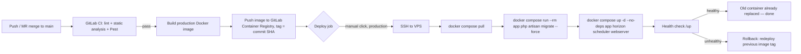

# CI/CD & Deployment Plan

**Target**: GitLab CI/CD → a VPS running the `docker-compose.yml` stack already
built for local dev, deploying automatically and (near-)seamlessly on every
merge to `main`.

**Status**: Phases 0, 1, 2 (config), 3, and 5 are implemented in-repo (see
checkboxes below). What's **not** done, because it needs an actual account/
server rather than code, is: creating the GitLab project + mirror (2.1),
provisioning the VPS (Phase 4), and setting the real CI/CD variables
(`SSH_PRIVATE_KEY`, `VPS_HOST`, `VPS_USER`) — that's the remaining work, and
it's manual by nature. See §6 for the concrete next steps.

---

## 1. Already in place (don't rebuild these)

- `docker/php/Dockerfile` — PHP 8.4-FPM image with all required extensions
- `docker-compose.yml` — app, webserver (nginx), mysql, redis, meilisearch,
  horizon, scheduler
- `.github/workflows/ci.yml` — lint (Pint) + static analysis (Larastan) + test
  (Pest) on GitHub Actions
- `/up` health-check route (`bootstrap/app.php`)

The GitLab pipeline reuses the Dockerfile and compose file rather than
reinventing them — the production image is a variant of the existing
Dockerfile, not a new one.

---

## 2. Decisions to make before writing any pipeline YAML

These block real progress, so resolve them first. Recommendation given for
each, but they're yours to change.

| # | Decision | Recommendation | Why |
|---|----------|-----------------|-----|
| 2.1 | Where does GitLab CI/CD actually run against, given the repo lives on GitHub (`github.com/mbats254/ecommerce-laravel-project`)? | **Pull mirror**: create a GitLab project, set up repository *pull mirroring* from the GitHub repo ("CI/CD for external repository"), run pipelines on the mirror. GitHub stays the canonical repo and its Actions CI can keep running too, or be retired later. | Avoids a disruptive full migration (PR history, issues, GitHub Actions all stay put) while getting GitLab pipelines running now. Full migration is a one-line config change later if you decide to fully move. |
| 2.2 | VPS provider | Any provider with a plain Ubuntu 22.04/24.04 box + a static IP (Hetzner, DigitalOcean, Linode, AWS Lightsail/EC2). | The plan is provider-agnostic — only needs SSH + Docker. |
| 2.3 | MySQL: self-hosted container vs managed DB | Managed (RDS / DO Managed MySQL) **if budget allows**; otherwise self-hosted container + automated `mysqldump` → S3 backup cron (bucket already exists, `af-south-1`). | The DB is the one component where losing data actually hurts. Containerizing it is fine to start, but only with backups from day one — call out explicitly in Phase 6 below so it isn't skipped. |
| 2.4 | Domain + TLS | Point a subdomain (e.g. `api.anchor.africa`) at the VPS; use Let's Encrypt via `certbot` (nginx) or swap nginx for Traefik with built-in ACME. | Needed regardless of deploy mechanism; do this once during server bootstrap. |
| 2.5 | Deploy gate for production | **Manual approval** (`when: manual` in GitLab) after tests pass — staging (if you stand one up) can auto-deploy. | This is an e-commerce API with live payments (Mpesa). A human click before production rollout is cheap insurance; still counts as CI/CD (continuous *delivery*, not full continuous *deployment*). Switch to fully automatic later if you want. |
| 2.6 | One environment or two (staging + production)? | Start with **production only**; add staging once the pipeline is proven. | Standing up a second VPS now is overhead the phased plan doesn't need yet — Phase 7 covers adding it later without rework. |

---

## 3. Target flow (once built)

---

## 4. Phases

### Phase 0 — Repository & pipeline parity (no deploy yet)

Goal: a GitLab pipeline that does what `.github/workflows/ci.yml` already
does, so nothing regresses while the deploy half is built.

- [ ] Create the GitLab project, set up pull mirroring from GitHub (2.1) —
      **manual, needs a GitLab account/decision, not done yet**
- [x] Add `.gitlab-ci.yml` with `lint`, `static-analysis`, `test` stages —
      direct port of the existing GitHub Actions job (same MySQL/Redis
      services, same Pint/Larastan/Pest commands)
- [ ] Confirm the mirrored pipeline goes green on a few real commits before
      touching anything deploy-related — blocked on the item above

### Phase 1 — Production Docker image

`docker/php/Dockerfile` is now multi-stage:

- [x] `app` target: `ARG APP_ENV` controls the composer install — `local`
      (default, used by `docker-compose.yml`) installs dev tooling
      (Pest/Pint/Larastan); `production` runs
      `composer install --no-dev --no-scripts ...`. Verified locally: the
      production build produced 5,437 autoloaded classes vs. ~8,258 for the
      dev build, confirming dev packages are actually excluded.
- [x] `web` target: `FROM nginx:1.27-alpine`, `COPY --from=app` bakes
      `public/` and `docker/nginx/default.conf` straight into the image —
      built from the same commit as `app`, so there's no drift between the
      two and the production server needs no git checkout for nginx config
      or static assets.
- [x] Config/route/view/event caching — **deliberately moved to container
      *boot* time, not image build time**, changing the original plan here:
      baking `config:cache` into the image would freeze in whatever env was
      present during the CI build (which has no access to the real
      production `.env`, and shouldn't). `docker/php/entrypoint.sh` now runs
      the four `artisan *:cache` commands when `OPTIMIZE_ON_BOOT=true` (set
      in `docker-compose.prod.yml`), after the real `.env` is mounted. Same
      performance benefit, correct values.
- [ ] Container healthcheck — skipped for now; the deploy script's `curl` at
      `/up` (Phase 5) already covers app+db+redis reachability end to end,
      and php-fpm doesn't speak HTTP so a container-level check would need
      `fcgi` tooling for little extra benefit. Revisit if orchestration ever
      needs container-level self-healing (e.g. a future move to
      Swarm/Kubernetes).
- [x] Built and booted locally (both `--target app` and `--target web`) to
      confirm the split works — see §7 "What broke during verification" below.

### Phase 2 — Container registry

- [x] Wired up in `.gitlab-ci.yml`'s `build` job: `docker build --target app`
      and `--target web`, tagged `$CI_REGISTRY_IMAGE/app:$CI_COMMIT_SHORT_SHA`
      / `.../web:$CI_COMMIT_SHORT_SHA`, pushed via the predefined
      `CI_REGISTRY_USER`/`CI_REGISTRY_PASSWORD` — no manual registry setup
      needed, GitLab's built-in registry activates automatically once the
      project exists (2.1)
- [x] Commit-SHA tagging only, no `latest` — matches the "never deploy off
      `latest`" rule
- [ ] Registry cleanup policy (GitLab project setting, UI-only — can't be
      expressed in `.gitlab-ci.yml`) — set this once the project exists

### Phase 3 — `docker-compose.prod.yml`

- [x] Created. Uses `${REGISTRY_IMAGE}/app:${IMAGE_TAG}` and
      `${REGISTRY_IMAGE}/web:${IMAGE_TAG}` (no `build:` key at all) for
      `app`/`horizon`/`scheduler`/`webserver` — no bind mounts of the repo
      anywhere in this file
- [ ] Decide 2.3 (managed vs containerized MySQL) and reflect it here — the
      file currently ships with the MySQL service **commented out** with
      instructions either way; nothing to do until 2.3 is actually decided
- [x] `redis` and `meilisearch` are self-hosted containers with named
      volumes (`redis-data`, `meilisearch-data`) — both are the "cheap to
      lose" side of the stack (Meilisearch is re-indexable from MySQL via
      `artisan scout:import`), so neither needed the Phase 6 backup
      treatment that MySQL does

### Phase 4 — Server bootstrap (one-time, manual, not in CI)

- [ ] Provision the VPS, install Docker + Compose plugin
- [ ] Create a dedicated `deploy` user (not root) in the `docker` group
- [ ] Generate an SSH keypair for CI; add the **public** key to the
      `deploy` user's `authorized_keys`
- [ ] Add the **private** key as a protected + masked GitLab CI/CD variable
      (`SSH_PRIVATE_KEY`), plus `VPS_HOST` and `VPS_USER`
- [ ] Copy `docker-compose.prod.yml`, `docker/nginx/`, and a production
      `.env` (created directly on the server — **never committed, never
      passed through CI logs**) into a fixed path, e.g. `/opt/anchor-api/`
- [ ] Point nginx/Traefik at the domain from 2.4, issue the TLS cert
- [ ] `docker compose -f docker-compose.prod.yml up -d` once by hand to
      confirm the server side works before wiring CI to automate it

### Phase 5 — The deploy job itself

- [x] `deploy:production` job in `.gitlab-ci.yml`: `when: manual`,
      restricted to `main`, `environment: production`
- [x] Loads `SSH_PRIVATE_KEY` via `ssh-agent`, `scp`s `deploy/deploy.sh` to
      the server, then runs it over SSH with `REGISTRY_IMAGE` and the commit
      SHA — the script itself lives in the repo
      ([`deploy/deploy.sh`](../deploy/deploy.sh)), not inlined in YAML, so
      it's testable/editable without touching pipeline config. It: pulls the
      new `app`/`webserver` images, runs `artisan migrate --force` in a
      one-off container (old containers still serving traffic at this
      point), recreates `app`/`horizon`/`scheduler`/`webserver` on the new
      image, then polls `/up` for up to 30s before declaring success or
      failure
- [x] `deploy:rollback` job (same file): identical mechanism, but takes a
      `ROLLBACK_TAG` variable (set via GitLab's "Run pipeline" custom
      variables) instead of `$CI_COMMIT_SHORT_SHA` — redeploys any
      previously-built tag without a rebuild
- [ ] `migrate --force` runs against the **new** image but the **old**
      containers are still serving traffic until the `up -d` line — so
      migrations must always be additive/backward-compatible with the code
      still running (expand/contract pattern: add columns before code that
      uses them ships; drop columns only after no running code reads them).
      This is a discipline to maintain going forward, not something to
      check off once.

### Phase 6 — Backups (only if 2.3 = containerized MySQL)

- [ ] A small scheduled job (cron on the VPS, or a GitLab scheduled pipeline
      that SSHes in) running `mysqldump` and uploading to the existing S3
      bucket, retained on a rotation (e.g. daily for 14 days)
- [ ] Document (and periodically test) the restore procedure — a backup
      nobody has restored from is not a backup

### Phase 7 — Hardening (do these once the basic pipeline is proven, not before)

- [ ] **Staging environment**: second VPS or a second compose stack on the
      same box with different ports, deployed automatically (no manual gate)
      on every merge to `main`, so production deploys are always
      pre-validated against a real environment
- [ ] **True zero-downtime (blue/green)**: the Phase 5 approach has a
      few-second gap while `app`/`horizon` containers restart (graceful
      shutdown finishes in-flight requests, but new connections briefly
      fail). If that gap ever actually matters, evolve to running two
      tagged `app` containers behind nginx with both listed as upstream
      servers, health-checking the new one, then draining and removing the
      old one — no gap at all. Don't build this upfront; it's real added
      complexity that the simple version doesn't need yet.
- [ ] **Alerting**: hook `/up` into an external uptime check (even a free
      tier one) so a bad deploy pages someone instead of waiting to be
      noticed
- [ ] **GitLab Environments**: use `environment: production` in the deploy
      job so GitLab tracks deploy history and gives you a one-click
      "Rollback" action in the UI on top of the manual redeploy script

---

## 5. Rollback

Every image is tagged by commit SHA (Phase 2), so rollback is: run the
`deploy:rollback` job (Phase 5, already in `.gitlab-ci.yml`) with
`ROLLBACK_TAG` set to the previous known-good SHA via GitLab's "Run
pipeline" screen. No rebuild needed — the image already exists in the
registry, and it's a few clicks, not a from-scratch SSH session.

---

## 6. Suggested order to actually start

1. ~~Phase 1 + 2 + 3 + 5 (image, registry config, compose file, deploy
   job)~~ — **done**, see checkboxes above. Verified locally end-to-end
   (§7).
2. **Next**: Phase 0's remaining item — create the GitLab project and set up
   pull mirroring from GitHub (2.1). This is the actual next action and it's
   a GitLab.com UI task, not a code task.
3. Push `.gitlab-ci.yml` through a few real commits once the mirror exists,
   confirm `lint`/`static-analysis`/`test` go green.
4. Phase 4 (server bootstrap) — one afternoon, manual, do it once. Needs
   2.2/2.3/2.4 decided first.
5. Set the three CI/CD variables (`SSH_PRIVATE_KEY`, `VPS_HOST`, `VPS_USER`)
   in GitLab, then trigger `deploy:production` manually on a trivial commit
   (e.g. a comment change) to prove the whole pipeline end to end before
   trusting it with anything real.
6. Phase 6 (backups) — don't skip if MySQL ends up containerized.
7. Phase 7 — only after the above has run cleanly for a while.

---

## 7. What broke during verification (worth knowing before you touch this again)

Building and boot-testing both image targets locally surfaced two real
issues — neither is a Docker/pipeline bug, but both will bite again if
forgotten:

1. **The `vendor` named volume can drift from `composer.json`.**
   `docker-compose.yml` intentionally keeps `vendor/` in a Docker volume
   (see the "Docker setup" README section) so the container's PHP 8.4
   dependencies don't collide with whatever the host's PHP installs. The
   cost: when `composer.json`/`composer.lock` change (a package added,
   e.g. Sentry got added to this project mid-way through this work) the
   *volume* doesn't know until someone runs
   `docker compose exec app composer install` inside the container.
   Forgetting this produces `Class "X" not found` errors that look like a
   broken image, not a stale volume. Run that command after pulling any
   change that touches `composer.lock`.
2. **`AppServiceProvider` only registers Telescope in `local`/`staging`**
   (`$this->app->environment('local', 'staging')`). The production image
   build (`--no-dev`) correctly excludes the Telescope package — so if a
   production-built image is ever booted with `APP_ENV` still set to
   `local` (e.g. testing the prod image against a leftover dev `.env`), it
   crashes trying to load a class that was deliberately never installed.
   Not a bug — it means the production `.env` **must** have
   `APP_ENV=production` for real, which Phase 4 already assumes, but it's
   easy to get wrong during ad-hoc testing (as happened here).
3. Also fixed along the way: the production Dockerfile originally ran
   `composer dump-autoload --optimize --no-scripts` after copying app code
   in, meaning `artisan package:discover` never re-ran against the `--no-dev`
   vendor set — so a stale `bootstrap/cache/packages.php` (generated on
   whatever machine last ran `composer install` outside Docker) could list
   providers that don't exist in the trimmed image, failing at boot. Fixed
   by dropping `--no-scripts` from that step so package discovery always
   matches what was actually installed for that specific build.
