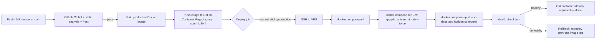

# CI/CD & Deployment Plan

**Target**: GitLab CI/CD → a VPS running the `docker-compose.yml` stack already
built for local dev, deploying automatically and (near-)seamlessly on every
merge to `main`.

**Status**: planning — nothing described here exists yet except what's called
out under "Already in place." This document is the checklist to work through,
in order.

---

## 1. Already in place (don't rebuild these)

- `docker/php/Dockerfile` — PHP 8.4-FPM image with all required extensions
- `docker-compose.yml` — app, webserver (nginx), mysql, redis, meilisearch,
  horizon, scheduler
- `.github/workflows/ci.yml` — lint (Pint) + static analysis (Larastan) + test
  (Pest) on GitHub Actions
- `/up` health-check route (`bootstrap/app.php`)

The GitLab pipeline reuses the Dockerfile and compose file rather than
reinventing them — the production image is a variant of the existing
Dockerfile, not a new one.

---

## 2. Decisions to make before writing any pipeline YAML

These block real progress, so resolve them first. Recommendation given for
each, but they're yours to change.

| # | Decision | Recommendation | Why |
|---|----------|-----------------|-----|
| 2.1 | Where does GitLab CI/CD actually run against, given the repo lives on GitHub (`github.com/mbats254/ecommerce-laravel-project`)? | **Pull mirror**: create a GitLab project, set up repository *pull mirroring* from the GitHub repo ("CI/CD for external repository"), run pipelines on the mirror. GitHub stays the canonical repo and its Actions CI can keep running too, or be retired later. | Avoids a disruptive full migration (PR history, issues, GitHub Actions all stay put) while getting GitLab pipelines running now. Full migration is a one-line config change later if you decide to fully move. |
| 2.2 | VPS provider | Any provider with a plain Ubuntu 22.04/24.04 box + a static IP (Hetzner, DigitalOcean, Linode, AWS Lightsail/EC2). | The plan is provider-agnostic — only needs SSH + Docker. |
| 2.3 | MySQL: self-hosted container vs managed DB | Managed (RDS / DO Managed MySQL) **if budget allows**; otherwise self-hosted container + automated `mysqldump` → S3 backup cron (bucket already exists, `af-south-1`). | The DB is the one component where losing data actually hurts. Containerizing it is fine to start, but only with backups from day one — call out explicitly in Phase 6 below so it isn't skipped. |
| 2.4 | Domain + TLS | Point a subdomain (e.g. `api.anchor.africa`) at the VPS; use Let's Encrypt via `certbot` (nginx) or swap nginx for Traefik with built-in ACME. | Needed regardless of deploy mechanism; do this once during server bootstrap. |
| 2.5 | Deploy gate for production | **Manual approval** (`when: manual` in GitLab) after tests pass — staging (if you stand one up) can auto-deploy. | This is an e-commerce API with live payments (Mpesa). A human click before production rollout is cheap insurance; still counts as CI/CD (continuous *delivery*, not full continuous *deployment*). Switch to fully automatic later if you want. |
| 2.6 | One environment or two (staging + production)? | Start with **production only**; add staging once the pipeline is proven. | Standing up a second VPS now is overhead the phased plan doesn't need yet — Phase 7 covers adding it later without rework. |

---

## 3. Target flow (once built)



---

## 4. Phases

### Phase 0 — Repository & pipeline parity (no deploy yet)

Goal: a GitLab pipeline that does what `.github/workflows/ci.yml` already
does, so nothing regresses while the deploy half is built.

- [ ] Create the GitLab project, set up pull mirroring from GitHub (2.1)
- [ ] Add `.gitlab-ci.yml` with `lint`, `static-analysis`, `test` stages —
      direct port of the existing GitHub Actions job (same MySQL/Redis
      services, same Pint/Larastan/Pest commands)
- [ ] Confirm the mirrored pipeline goes green on a few real commits before
      touching anything deploy-related

### Phase 1 — Production Docker image

The current `docker/php/Dockerfile` is a **dev** image (installs dev
dependencies like Pest/Pint so `docker compose exec app php artisan test`
works locally). Production needs a leaner variant.

- [ ] Add a build arg (`ARG APP_ENV=local`) or a second stage so the
      production build runs:
      `composer install --no-dev --optimize-autoloader --no-interaction`
- [ ] Bake config/route/view caching into the image build
      (`php artisan config:cache && route:cache && view:cache`) — this must
      happen *inside* the image build, not at container start, since the
      production compose file won't bind-mount source over it
- [ ] Add a healthcheck to the image/container hitting `/up`
- [ ] Build it locally once and confirm it boots without the dev `vendor`
      packages present

### Phase 2 — Container registry

- [ ] Use GitLab's built-in Container Registry (`registry.gitlab.com/...`) —
      no separate registry account needed, and CI auth is automatic via
      `CI_REGISTRY_*` predefined variables
- [ ] Tag images with the commit SHA (`$CI_COMMIT_SHORT_SHA`) — never
      `latest` for a real deploy, so every deploy is traceable to a commit and
      trivially rollback-able by tag
- [ ] Add a registry cleanup policy (GitLab project setting) so old tags
      don't accumulate forever

### Phase 3 — `docker-compose.prod.yml`

A second compose file, not a modification of the dev one — production must
**not** bind-mount the repo over the baked image.

- [ ] `docker-compose.prod.yml`: same services as `docker-compose.yml` minus
      the `.:/var/www/html:cached` bind mount on `app`/`horizon`/`scheduler` —
      they run purely off the built image
- [ ] `image: registry.gitlab.com/.../anchor-api:${IMAGE_TAG}` instead of
      `build:` for those three services
- [ ] Decide 2.3 (managed vs containerized MySQL) and reflect it here — if
      containerized, keep the named volume + add the backup cron from Phase 6

### Phase 4 — Server bootstrap (one-time, manual, not in CI)

- [ ] Provision the VPS, install Docker + Compose plugin
- [ ] Create a dedicated `deploy` user (not root) in the `docker` group
- [ ] Generate an SSH keypair for CI; add the **public** key to the
      `deploy` user's `authorized_keys`
- [ ] Add the **private** key as a protected + masked GitLab CI/CD variable
      (`SSH_PRIVATE_KEY`), plus `VPS_HOST` and `VPS_USER`
- [ ] Copy `docker-compose.prod.yml`, `docker/nginx/`, and a production
      `.env` (created directly on the server — **never committed, never
      passed through CI logs**) into a fixed path, e.g. `/opt/anchor-api/`
- [ ] Point nginx/Traefik at the domain from 2.4, issue the TLS cert
- [ ] `docker compose -f docker-compose.prod.yml up -d` once by hand to
      confirm the server side works before wiring CI to automate it

### Phase 5 — The deploy job itself

- [ ] Add a `deploy` stage to `.gitlab-ci.yml`, `when: manual`, restricted to
      `main`
- [ ] Job installs an SSH client, loads `SSH_PRIVATE_KEY`, and runs a deploy
      script over SSH (kept in `deploy/deploy.sh` in the repo, not inlined in
      YAML, so it's testable/editable without touching pipeline config):

  ```bash
  #!/usr/bin/env bash
  set -euo pipefail
  cd /opt/anchor-api

  export IMAGE_TAG="$1"

  docker compose -f docker-compose.prod.yml pull app horizon scheduler
  docker compose -f docker-compose.prod.yml run --rm app php artisan migrate --force
  docker compose -f docker-compose.prod.yml up -d --no-deps app horizon scheduler

  # Wait for the new app container to report healthy before declaring success
  for i in $(seq 1 15); do
    if curl -fsS http://localhost:8000/up > /dev/null; then
      echo "Deploy OK: $IMAGE_TAG"
      exit 0
    fi
    sleep 2
  done

  echo "Health check failed after deploy — rolling back to previous tag"
  docker compose -f docker-compose.prod.yml pull app horizon scheduler  # previous tag
  exit 1
  ```

- [ ] `migrate --force` runs against the **new** image but the **old**
      containers are still serving traffic until the `up -d` line — so
      migrations must always be additive/backward-compatible with the code
      still running (expand/contract pattern: add columns before code that
      uses them ships; drop columns only after no running code reads them)

### Phase 6 — Backups (only if 2.3 = containerized MySQL)

- [ ] A small scheduled job (cron on the VPS, or a GitLab scheduled pipeline
      that SSHes in) running `mysqldump` and uploading to the existing S3
      bucket, retained on a rotation (e.g. daily for 14 days)
- [ ] Document (and periodically test) the restore procedure — a backup
      nobody has restored from is not a backup

### Phase 7 — Hardening (do these once the basic pipeline is proven, not before)

- [ ] **Staging environment**: second VPS or a second compose stack on the
      same box with different ports, deployed automatically (no manual gate)
      on every merge to `main`, so production deploys are always
      pre-validated against a real environment
- [ ] **True zero-downtime (blue/green)**: the Phase 5 approach has a
      few-second gap while `app`/`horizon` containers restart (graceful
      shutdown finishes in-flight requests, but new connections briefly
      fail). If that gap ever actually matters, evolve to running two
      tagged `app` containers behind nginx with both listed as upstream
      servers, health-checking the new one, then draining and removing the
      old one — no gap at all. Don't build this upfront; it's real added
      complexity that the simple version doesn't need yet.
- [ ] **Alerting**: hook `/up` into an external uptime check (even a free
      tier one) so a bad deploy pages someone instead of waiting to be
      noticed
- [ ] **GitLab Environments**: use `environment: production` in the deploy
      job so GitLab tracks deploy history and gives you a one-click
      "Rollback" action in the UI on top of the manual redeploy script

---

## 5. Rollback

Every image is tagged by commit SHA (Phase 2), so rollback is: re-run the
Phase 5 deploy job with `IMAGE_TAG` set to the previous known-good SHA. No
rebuild needed — the image already exists in the registry. Keep this as a
manual GitLab job (`deploy:rollback`) that takes the tag as a pipeline
variable, so it's a few clicks, not a from-scratch SSH session.

---

## 6. Suggested order to actually start

1. Phase 0 (GitLab pipeline parity) — get *something* green in GitLab this
   week, independent of everything else.
2. Phase 1 + 2 (production image + registry) — can be built and tested
   locally (`docker build`, `docker push`) before any server exists.
3. Phase 4 (server bootstrap) — one afternoon, manual, do it once.
4. Phase 3 + 5 (compose file + deploy job) — wire CI to the now-existing
   server.
5. Ship a trivial change (e.g. a comment) through the full pipeline end to
   end before trusting it with anything real.
6. Phase 6 (backups) — don't skip if MySQL ends up containerized.
7. Phase 7 — only after the above has run cleanly for a while.
